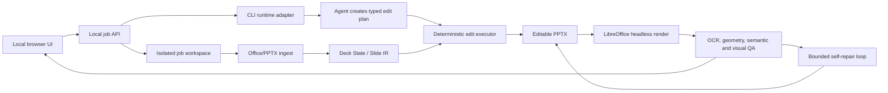
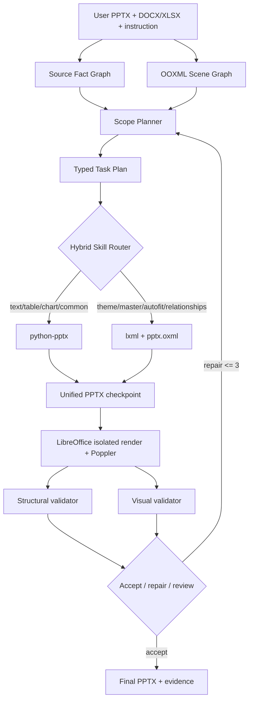

# Research Report: Agent Edit Slide

Determine a practical local cross-platform architecture that accepts slide templates or sample slides plus natural-language or Docs/Word/Excel requirements, edits and updates data while preserving visual fidelity, and returns a completed slide using agent CLI runtimes without API keys.

## Status

- Exploring: 0
- Pending: 1
- Pruned: 2
- Validated: 5

## Nodes

- `1` **Agent Edit Slide** — PENDING: Determine a practical local cross-platform architecture that accepts slide templates or sample slides plus natural-language or Docs/Word/Excel requirements, edits and updates data while preserving visual fidelity, and returns a completed slide using agent CLI runtimes without API keys.
- `1.1` **Input and artifact understanding** — VALIDATED: Existing slide decks and office documents can be normalized into a structured intermediate representation for reliable editing.
- `1.2` **Agent CLI orchestration** — VALIDATED: A local desktop/web app can safely orchestrate Codex, Gemini, Claude and similar CLIs without embedding provider API keys.
- `1.3` **Slide editing engines** — VALIDATED: Programmatic PPTX editing plus rendering/vision verification is more reliable than asking an LLM to directly author binary slides.
- `1.4` **Cross-platform local UX** — VALIDATED: A local service with a browser UI and platform-specific CLI adapters can support Linux, macOS and Windows.
- `1.5` **Quality and safety** — VALIDATED: Render-diff, semantic data checks, sandboxing and human approval gates are required for production-quality output.
- `1.1.1` **Screenshot-only representation** — PRUNED: A screenshot plus OCR is sufficient as the primary editing representation for preserving editable PowerPoint structure.
- `1.3.1` **Direct LLM binary authoring** — PRUNED: An LLM can directly manipulate PPTX binaries without a constrained intermediate model and still preserve complex templates.

## Synthesis

### Recommended product

Build a local-first web application with a browser UI and a local orchestration daemon. The daemon owns a job workspace, invokes an already-authenticated agent CLI runtime, applies deterministic slide operations, renders previews, runs semantic and visual QA, and returns a downloadable `.pptx` plus preview images and an audit log.

The product should support: a `.pptx` template/sample deck; `.docx`, `.xlsx`, `.csv`, `.pdf`, image or text source files; and natural-language instructions such as “update the Q3 revenue slide using this Excel file, keep the template, and add a footnote.”

### Core architecture



The agent must emit a typed edit plan, not arbitrary shell commands. Operations include `replace_text`, `update_table`, `update_chart_data`, `replace_image`, `duplicate_slide`, `move_shape`, `resize_text`, and `preserve`. Each operation targets a stable slide/object identifier and declares a preservation scope.

### Recommended implementation choices

| Layer | Recommendation | Reason |
|---|---|---|
| UI | React/Vite or Next.js served locally | Browser UI works on Linux, macOS and Windows. |
| Local API | Python FastAPI or Node service | File upload, job state, progress streaming, cancellation and artifact download. |
| Office extraction | `python-docx`, `openpyxl`, `pandas`, PDF/text extraction | Normalize source documents into facts with provenance. |
| PPTX patching | XML-preserving clone-and-fill; `python-pptx` for controlled edits; PptxGenJS for new objects | Existing complex slides should be cloned and minimally patched. |
| Rendering | LibreOffice `soffice --headless` to PDF, then Poppler/ImageMagick | Cross-platform render and preview loop. |
| Agent runtime | Adapters for `codex`, `gemini`, `claude` | Reuse installed/authenticated CLIs without app-managed API keys. |
| State | SQLite + per-job filesystem workspace | Local, inspectable and resumable. |
| Packaging | Python launcher, optional Tauri wrapper | Start as local browser app; package later if desired. |

### Agent runtime contract

```text
detect() -> installed, version, auth_status
run(task_json, workspace, policy) -> streamed events
cancel(job_id) -> result
```

The adapter invokes a non-interactive/headless mode only after detecting completed CLI login. If no runtime is authenticated, the UI shows a setup error and login instruction. The app never asks the user to paste an API key.

### End-to-end workflow

1. Upload template/sample and optional source files.
2. Extract slide XML, text, tables, charts, media, theme/font metadata and thumbnails.
3. Give the agent a compact manifest, thumbnails, source facts and user instruction.
4. Agent returns JSON edit plan with target IDs, values, confidence, provenance and preservation constraints.
5. Validate the plan against a schema and apply only allowed operations.
6. Render PDF/PNG previews.
7. Check required values, source-to-slide provenance, overflow, clipping, changed regions, font substitution, chart/table consistency and untouched-region preservation.
8. On failure, send only evidence to a bounded repair step.
9. Show before/after thumbnails, changed objects, warnings and final `.pptx` download.

### Key decisions

- Screenshots are for grounding and verification, not the source of truth; they lose native PowerPoint structure and editability.
- Free-form LLM-generated PPTX code is unsafe for complex templates; use a constrained intermediate representation and deterministic patcher.
- API-key configuration is outside the product contract. CLI login remains explicit onboarding, but the app does not store or request provider keys.
- The first release should use one selected runtime per job. Add planner/reviewer runtime separation only after the single-runtime path is reliable.

### MVP scope

`.pptx` + `.xlsx` + natural-language instruction; text/table/chart updates; clone-and-fill templates; local Codex/Gemini/Claude adapter; LibreOffice rendering; before/after preview; semantic checks; and manual approval before download.

Defer arbitrary redesign, animations/transitions, OLE objects, PowerPoint COM automation, collaboration, cloud storage and autonomous multi-agent repair.

### Acceptance criteria

- Runs on Linux, macOS and Windows with documented prerequisites.
- Has no API-key field, API-key file, or provider secret storage.
- Preserves native editability of unchanged and patched objects.
- Produces `.pptx`, PDF preview and per-slide QA report.
- Rejects ambiguous or low-confidence mappings instead of silently writing wrong numbers.
- Links every changed value to a source cell, paragraph or explicit user instruction.

### Evidence and limitations

Evidence includes the official Codex CLI repository, Gemini CLI authentication documentation, Claude Code headless documentation, python-pptx, PptxGenJS, `pptx-gen`, and UIUC-MONET/SLIDEFORGE. SLIDEFORGE is especially relevant because it treats slides as structured editable artifacts and includes rendered-state verification and OCR-diff self-repair.

NotebookLM authentication was present locally, but notebook creation/listing timed out before a grounded answer was returned. This report does not attribute claims to NotebookLM; a future run should import the cited URLs into a dedicated notebook and append its answer as separately labeled evidence.

## Deep paper analysis

### 1. Auto-Slides: the content and pedagogy layer

Auto-Slides is primarily a paper-to-presentation system, not a faithful business-template editor. Its most transferable ideas are:

- Parse difficult source documents into high-fidelity structured Markdown, with tables and equations extracted into JSON rather than left in a long context window.
- Change from paper-centric IMRaD order to a presentation-centric Problem–Motivation–Results–Conclusion narrative.
- Separate Parser/Planner, Verification/Adjustment, Generator and Editor roles.
- Use a verification-adjustment loop to detect omissions and factual drift before generation.
- Keep an interactive editor for human-directed refinement.

For Agent Edit Slide, this becomes a `Source Understanding + Narrative Planner` subsystem. It should not be allowed to rewrite the template directly. The planner produces content facts, source citations, and a slide-level intent graph; a separate executor decides how those facts map to existing placeholders, tables and charts.

The paper reports user-study benefits for structure and comprehension, but the evaluation is mainly educational and uses small human-study samples. It is evidence for the value of structured planning and verification, not evidence that the system can preserve arbitrary corporate PPTX templates.

### 2. PPTAgent: the reference-slide and edit-action layer

PPTAgent is closer to the requested product. It analyzes reference presentations, clusters slide functional types, extracts content schemas, plans an outline, selects reference slides, and generates executable edit actions such as replacing spans or images. Its key insight is to treat generation as editing a good reference slide instead of recreating style from scratch.

Its ablations show why the stages matter: removing schema, outline, structure or code-rendering lowers success or quality. Its error analysis is especially useful for implementation: invalid syntax, invalid element indices, instruction violations, hallucinated assets and incorrect API usage are distinct failure classes. Self-correction reduces many index/instruction/function errors, but syntax and hallucinated-asset errors persist more.

For Agent Edit Slide, adopt `slide schema + typed edit actions + execution feedback`, but replace arbitrary generated code with a closed operation vocabulary and schema validation. Reference-slide clustering is useful when a deck contains multiple slide archetypes; for a single user template, direct object mapping is cheaper.

### 3. Talk to Your Slides: the strongest fit for repetitive editing

Talk to Your Slides directly targets existing-slide editing. It separates high-level instruction understanding from low-level object manipulation and uses the PowerPoint object model rather than screen pixels for text-centric and batch tasks. The paper reports 34% faster processing, 34% better instruction fidelity and 87% lower cost than GUI baselines for its scope.

The most important boundary is explicit in the paper: structured access is superior for text-centric edits, but visual information remains necessary for overflow, alignment, spatial relationships and aesthetic judgments. Its TSBench-Hard categories are directly applicable to product design:

- visual-dependent tasks;
- ambiguous aesthetic instructions;
- multi-step edits;
- impossible/cross-modal requests where the agent must refuse instead of hallucinate.

The best architecture is therefore hybrid, not purely visual or purely structural:

```text
structured object model -> planning, text/data edits, batch operations
rendered slide image     -> overflow, alignment, contrast, visual grounding
deterministic validators  -> schema, numbers, object existence, file integrity
human approval            -> ambiguous design choices and high-impact changes
```

### 4. Emerging benchmarks: what “good” must mean

PPTAGENT/PPTEVAL evaluates Content, Design and Coherence. TSBench evaluates instruction execution and refusal behavior. Newer work such as PPTArena and PPT-Eval emphasizes in-place editing, compound tasks, structural diffs, visual diffs, partial credit, unnecessary changes and long-horizon reliability. DynaSlide is particularly aligned with the requested business use case: bring-your-own-template updates driven by natural-language instructions and external data.

The product should not use a single “slide looks good” score. It needs at least five independent scores:

1. **Instruction fidelity** — did the requested operation happen?
2. **Data correctness** — do displayed values equal the source values and formulas?
3. **Structural preservation** — were untouched objects, masters, themes and editability preserved?
4. **Visual quality** — no overflow, clipping, bad alignment, contrast or broken chart.
5. **Refusal quality** — does the system stop safely when the request is ambiguous, impossible or unsupported?

### Current technical problems

1. **Object identity is unstable.** PPTX XML IDs, shape indexes and PowerPoint application object IDs are not always stable after save/round-trip. Use a canonical object fingerprint: slide index + normalized text + approximate bbox + type + neighboring context, then re-resolve after every mutation.
2. **Charts and tables have multiple sources of truth.** A chart may contain embedded workbook data, cached values and visual labels. The executor must update the authoritative data and then verify rendered labels.
3. **Text expansion breaks layout.** Translation and updated numbers change width/height. Add a text-fit policy: preserve font first, then controlled font-size reduction, then line/box expansion within a declared safe region, otherwise fail for review.
4. **Rendering differs by platform.** Fonts and Office/LibreOffice behavior vary. Package a deterministic render environment where possible, record font substitutions, and treat a native PowerPoint/Office render as the final Windows verification path for high-risk decks.
5. **Visual correctness is not semantic correctness.** A slide can look polished but contain a wrong number. Every displayed business value needs provenance back to a source cell, document paragraph or user instruction.
6. **Long-horizon drift.** Repeated edits can gradually damage a deck. Preserve the original, create immutable checkpoints, and compare each edit against both the previous version and the original template.
7. **Ambiguity and unsupported requests.** “Make it more professional” or “fix the chart” needs clarification or a bounded interpretation. “Identify the speaker in an embedded video” should be rejected if the system lacks that modality.
8. **Agent shell risk.** CLI runtimes can execute arbitrary code. Run each job in a disposable workspace with an allowlisted tool broker; the agent should not receive general filesystem or network access by default.

## Best method for the requested product

The best practical method is a **hybrid structure-first, vision-verified, edit-based agent**:

### Phase A — Ingest and canonicalize

Extract native PPTX objects, relationships, themes, masters, notes, charts, tables, images and fonts. Render every slide. Build a Deck State Graph with nodes for slide, group, text, image, chart, table, connector and background, plus containment, reading-order, z-order and source-provenance edges.

### Phase B — Understand source data

Normalize DOCX/XLSX/PDF/text into a source fact graph. Preserve sheet/cell, paragraph, page and table coordinates. Convert formulas and numeric values into typed facts. Never give the agent only a flattened text dump for data-update tasks.

### Phase C — Plan

The selected CLI runtime receives: user instruction, source fact graph, slide manifest, thumbnails, supported operations and policy. It returns a JSON plan with target scope, preservation scope, confidence, provenance and expected postconditions.

### Phase D — Execute

Apply high-confidence operations deterministically. Prefer XML-preserving clone-and-fill for existing complex slides. Use higher-level libraries only for operations they can represent safely. For unsupported objects, mark the operation as `needs_review` instead of approximating.

### Phase E — Verify and repair

Run structural checks first, then render. Compare OCR/text, numeric facts, bounding boxes, changed regions, font metrics, contrast and chart/table consistency. Permit at most 1–2 bounded repair rounds. If the same failure repeats, stop and present evidence.

### Phase F — Approve and deliver

Show before/after thumbnails, changed-object list, data provenance, warnings and confidence. Require approval for low-confidence, visually dependent, destructive or cross-slide changes. Deliver the final editable PPTX and QA artifacts.

## Research direction ranking

| Direction | Value | Cost/risk | Recommendation |
|---|---:|---:|---|
| Structure-aware text/table/data editing | Very high | Low/medium | Build first; core MVP. |
| Template clone-and-fill | Very high | Medium | Build first; strongest fit to user request. |
| Vision verification and self-repair | Very high | Medium | Build in MVP for trustworthiness. |
| Reference-slide clustering/schema extraction | High | Medium | Add after single-template flow works. |
| Full GUI PowerPoint automation | Medium | High/platform-specific | Use only for Windows fallback/high-fidelity cases. |
| End-to-end pixel/image generation | Low for this product | High | Prune; loses editability and data provenance. |
| Autonomous multi-agent debate | Medium | High | Defer; bounded planner-reviewer is enough initially. |

## Concrete research-to-product thesis

The differentiator should not be “an LLM that makes slides.” It should be:

> A local, auditable, template-preserving slide update engine that combines CLI agents for intent and planning with deterministic object-level editing and render-based verification.

That thesis directly combines Auto-Slides’ verification loop, PPTAgent’s reference-schema/edit-action workflow, Talk to Your Slides’ structure-first execution, and the newer benchmark emphasis on compound edits, refusal, structural diffs and visual quality.

## NotebookLM grounded follow-up

### Notebook and imported sources

- Notebook: `Deep Research - Agent Edit Slide Papers`
- Notebook ID: `ab424ccf-2440-4a85-a6a5-115e22be090f`
- Imported sources: Auto-Slides (`2509.11062`), PPTAGENT (`2025.emnlp-main.728`), and Talk to Your Slides (`2026.findings-acl.166`).
- NotebookLM deep-research run completed successfully and returned additional sources and a synthesized report.

### Grounded conclusions

NotebookLM's cross-paper comparison strengthens the previous conclusion: the best architecture is a structure-aware hybrid object-model agent with local headless rendering and modality-decoupled verification.

1. **Do not use one execution path.** NotebookLM's synthesis reports that XML-only execution lacks convenient deck-wide operations, while `python-pptx`-only execution lacks fine-grained structural control. Hybrid routing performs better: high-level APIs for common content/data operations and low-level OOXML patching for theme, master, relationship and auto-fit operations.
2. **Use run-level text representation.** A placeholder may contain multiple formatting runs. Parsing at run-level preserves font, weight, color and inline styling while enabling precise replacement.
3. **Parse only the target scope first.** For long decks, plan slide scope before parsing all slides. This reduces context, prevents collateral edits and improves long-horizon reliability.
4. **Separate structural and visual judges.** NotebookLM's deep research reports that a single VLM judge given all signals is overloaded and can be over-lenient. One validator should compare before/after structured state and requested operations; another should inspect rendered images for overflow, clipping, overlap and contrast.
5. **Make repair bounded.** Self-reflection improves difficult multi-step edits, but most corrections happen early. Use a maximum of 2–3 repair passes and then stop with evidence.
6. **Keep COM optional.** COM is useful for high-fidelity Windows/PowerPoint execution but is platform-bound and difficult to parallelize. For Linux/macOS/Windows portability, the primary engine should use `python-pptx` plus `lxml`/`pptx.oxml`, with COM as an optional Windows adapter.
7. **Treat refusal as a capability.** Visual-dependent, ambiguous and impossible requests need explicit refusal or human review, not guessed edits.

### NotebookLM recommended architecture



### NotebookLM research gaps and roadmap

The follow-up NotebookLM query identified five major unsolved problems:

- reliable text overflow and non-rectangular geometry detection;
- cross-platform execution without PowerPoint/COM;
- long-deck target isolation and state drift;
- merged cells, charts, SmartArt, equations and master inheritance;
- spatial/aesthetic reasoning and ambiguous instructions.

Recommended staged roadmap:

**Stage 1 — Structural single-slide MVP:** run-level parser, typed operations, hybrid `python-pptx`/OOXML executor, sandboxed error-reflection loop.

**Stage 2 — Template-preserving long-deck updates:** target-scope planner, XLSX-to-table/chart mapping, merged-cell handling, scene-graph diff validator and immutable checkpoints.

**Stage 3 — Hybrid visual verification research prototype:** isolated LibreOffice/Poppler rendering, overflow/bounds clamping, separate structural and visual validators, bounded auto-repair.

### Important caveat

NotebookLM's deep-research report includes useful synthesis and newly surfaced papers, but some additional sources are secondary or generated research references. Use the three imported papers as the primary evidence, and independently verify any newly surfaced paper or benchmark before making implementation or publication claims.
