# Research Tree: Agent Edit Slide

Objective: Determine a practical local cross-platform architecture that accepts slide templates or sample slides plus natural-language or Docs/Word/Excel requirements, edits and updates data while preserving visual fidelity, and returns a completed slide using agent CLI runtimes without API keys.

```mermaid
flowchart TD
    n1["1: Agent Edit Slide &#91;VALIDATED&#93;"]
    n1_1["1.1: Input and artifact understanding &#91;VALIDATED&#93;"]
    n1_2["1.2: Agent CLI orchestration &#91;VALIDATED&#93;"]
    n1_3["1.3: Slide editing engines &#91;VALIDATED&#93;"]
    n1_4["1.4: Cross-platform local UX &#91;VALIDATED&#93;"]
    n1_5["1.5: Quality and safety &#91;VALIDATED&#93;"]
    n1_1_1["1.1.1: Screenshot-only representation &#91;PRUNED&#93; — Screenshot/OCR loses native text boxes, charts, tables, grouping, z-order and editability; use it only as a visual verification signal, not the source of truth."]
    n1_3_1["1.3.1: Direct LLM binary authoring &#91;PRUNED&#93; — Open-ended binary mutation has high corruption and layout-drift risk; constrain actions through a slide IR and deterministic patch engine."]
    n1_6["1.6: Paper-derived architecture &#91;VALIDATED&#93;"]
    n1_7["1.7: Evaluation and failure boundaries &#91;VALIDATED&#93;"]
    n1_8["1.8: Data-driven template updates &#91;VALIDATED&#93;"]
    n1 --> n1_1
    n1 --> n1_2
    n1 --> n1_3
    n1 --> n1_4
    n1 --> n1_5
    n1_1 --> n1_1_1
    n1_3 --> n1_3_1
    n1 --> n1_6
    n1 --> n1_7
    n1 --> n1_8
```

## Insights

- `1`: Use a structured slide representation linked to native PPTX objects, rendered regions and source provenance; screenshots are verification evidence, not the editable source.
- `1`: Use provider-neutral local CLI adapters and reuse user login state; do not collect or store API keys.
- `1`: Prefer clone-and-fill plus constrained patch operations, with native object generation only where needed.
- `1`: Make render-diff, semantic completeness, provenance and manual approval first-class quality gates.
- `1.1`: Use a structured slide representation linked to native PPTX objects, rendered regions and source provenance; screenshots are verification evidence, not the editable source.
- `1.2`: Use provider-neutral local CLI adapters and reuse user login state; do not collect or store API keys.
- `1.3`: Prefer clone-and-fill plus constrained patch operations, with native object generation only where needed.
- `1.5`: Make render-diff, semantic completeness, provenance and manual approval first-class quality gates.
