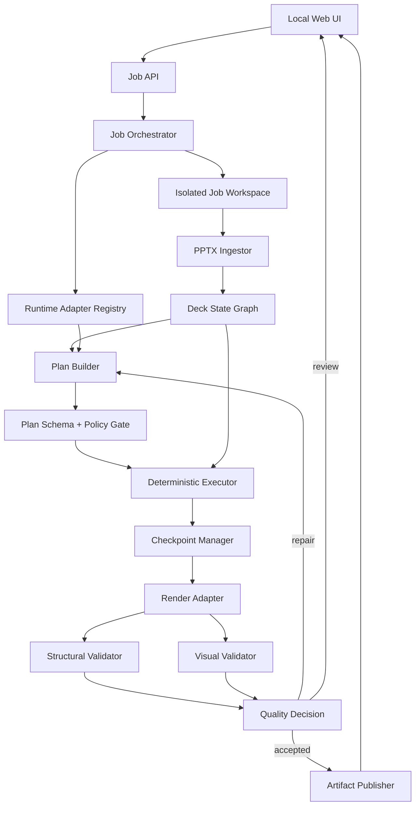

# System Design: AutoSlide MVP and Roadmap

**Spec ID:** ADS-001  
**Status:** DRAFT — Gate #0 pending

## 1. Design principles

1. **Template is the source of truth.** Edit existing objects whenever possible; do not redraw a complex slide.
2. **Agent plans, tools execute.** The agent emits typed intent; deterministic code performs mutations.
3. **Structure first, vision where needed.** Use native PPTX structure for text/data edits and rendered images for layout judgment.
4. **Evidence before acceptance.** Every accepted output has structural diff, render preview and QA result.
5. **Local-first and provider-neutral.** The app orchestrates installed CLI runtimes and owns no provider API keys.

## 2. Logical architecture



## 3. Component responsibilities

### 3.1 Job API

Responsibilities: create job, upload PPTX, submit instruction, stream status, expose previews, approve/reject, cancel and download artifacts.

Boundary: it never mutates PPTX directly and never invokes a provider CLI without the Job Orchestrator.

### 3.2 Job Orchestrator

Responsibilities: state machine, timeout, cancellation, checkpoint transitions, runtime selection and retry budget.

Suggested states:

```text
CREATED → INGESTING → PLANNING → AWAITING_PLAN_REVIEW
        → EXECUTING → RENDERING → VERIFYING
        → REPAIRING → AWAITING_USER_APPROVAL → ACCEPTED
        ↘ FAILED / CANCELLED
```

### 3.3 PPTX Ingestor

Responsibilities: validate OPC package, extract slide metadata, parse shape tree, resolve groups/bounds, collect text runs, detect tables/charts/media and render a thumbnail manifest.

Output: `DeckStateGraph` with stable internal references. Native XML IDs are treated as hints, not durable identities.

Stable reference strategy: slide index + object type + object name + normalized text fingerprint + approximate bounds + neighborhood fingerprint. Re-resolve references after each save.

### 3.4 Runtime Adapter Registry

```text
detect() -> RuntimeStatus
start(job_context, prompt_payload) -> RuntimeHandle
stream(handle) -> AgentEvent
cancel(handle) -> CancelResult
```

The adapter creates a constrained working directory, passes a compact manifest and plan schema, captures stdout/stderr separately, applies timeouts, and redacts sensitive environment values. The app checks CLI authentication but never receives a raw token.

### 3.5 Plan Builder and policy gate

The planner input includes user instruction, slide inventory, thumbnails, supported operation schema and preservation policy. The output is a `TaskPlan`.

```json
{
  "schema_version": "1.0",
  "target_scope": [{"slide": 3, "object_ref": "shape-fingerprint"}],
  "operations": [
    {
      "op": "replace_text",
      "target": {"slide": 3, "object_ref": "shape-fingerprint", "run_range": [0, 1]},
      "value": "Updated title",
      "preserve": ["font", "position", "theme_color"],
      "confidence": 0.96,
      "postconditions": ["text_equals_value", "no_unintended_objects_changed"]
    }
  ],
  "requires_review": false
}
```

Policy gate rejects arbitrary code, unknown operations, broad scope without explicit instruction, missing preservation rules and low-confidence plans.

### 3.6 Deterministic executor

Route operations by capability:

| Operation family | Primary route | Fallback |
|---|---|---|
| Run-level text replacement | `python-pptx`/custom XML | review |
| Basic formatting | `python-pptx` | XML patch |
| Theme/master changes | XML patch | review |
| Shape bounds/position | `python-pptx` | XML patch |
| Tables/charts | dedicated typed adapter | review |
| Unsupported object | none | `needs_review` |

Every mutation writes a new checkpoint, validates package integrity and records a machine-readable diff.

### 3.7 Quality gates

Structural gate:

- requested object exists and changed as planned;
- untouched objects have no unexpected property changes;
- slide/master/layout/media relationships remain valid;
- output reopens successfully;
- no missing fonts/media relationships are introduced where detectable.

Visual gate:

- render changed slides to PDF/PNG;
- detect overflow, clipping, overlap, unexpected blank regions, contrast and severe font substitution;
- compare before/after changed regions;
- produce defect severity and evidence image.

The gates remain separate. A VLM must not be the sole authority for structural preservation.

## 4. Data model

Initial SQLite entities:

- `jobs`: id, state, timestamps, runtime, instruction, input hash;
- `artifacts`: id, job id, type, path, sha256, created at;
- `plans`: job id, schema version, JSON, validation status;
- `checkpoints`: job id, stage, path, sha256, parent checkpoint;
- `findings`: job id, gate, severity, object ref, evidence path, resolution;
- `events`: job id, sequence, type, redacted payload, timestamp.

Reference documents are intentionally absent from this schema until phase 7.

## 5. API contract

### Create job

`POST /api/v1/jobs` — multipart form with `template` and `instruction`.

Response `202`:

```json
{
  "job_id": "job_123",
  "state": "CREATED",
  "status_url": "/api/v1/jobs/job_123",
  "events_url": "/api/v1/jobs/job_123/events"
}
```

### Job status

`GET /api/v1/jobs/{job_id}` returns state, progress, runtime status, warnings, artifact links and approval requirement.

### Approve/reject

`POST /api/v1/jobs/{job_id}/decision` with `{ "decision": "approve" | "reject" }`.

### Artifacts

`GET /api/v1/jobs/{job_id}/artifacts/{artifact_id}` downloads only artifacts belonging to the job.

## 6. Security and isolation

- Per-job temporary directory with restrictive permissions.
- Filename normalization and path traversal protection.
- Allowlist executable tools; no agent-provided executable path.
- No inherited secret environment variables except explicitly approved runtime settings.
- Resource limits: file size, slide count, runtime, repair attempts and output size.
- Redacted logs; no cookie/API-key/token contents.
- Cleanup policy preserves accepted artifacts and removes abandoned workspaces after retention period.

## 7. Cross-platform strategy

Primary engine: Python + OOXML, independent of PowerPoint installation.

Renderer: LibreOffice headless with isolated user profiles per job. Native PowerPoint/COM is an optional Windows verification adapter, not a core dependency. Runtime adapters use platform-specific command discovery and argument quoting but share the same contract.

## 8. Phase design

### Phase 1 — Foundation runtime

Deliver job state machine, workspace isolation, configuration, runtime detection and a minimal status API.

Exit gate: create/cancel job, detect installed runtimes, redact logs and recover interrupted state.

### Phase 2 — PPTX ingest

Deliver PPTX validation, shape/run inventory, fingerprints and thumbnails.

Exit gate: inventory fixture decks and re-resolve target references after save.

### Phase 3 — Edit planner

Deliver prompt payload, typed plan schema, target scope and policy validation.

Exit gate: valid plan, clarification for ambiguity, rejection of arbitrary code.

### Phase 4 — Executor

Deliver supported text/style/position operations and checkpoints.

Exit gate: expected edit applied, untouched-object diff clean, output reopens.

### Phase 5 — Quality gates

Deliver render adapter, structural diff, visual findings and bounded repair.

Exit gate: overflow/clip fixture detected and accepted output has evidence.

### Phase 6 — Local workbench

Deliver upload UI, live progress, before/after preview, findings and download.

Exit gate: complete user workflow on Linux/macOS/Windows development environments.

### Phase 7 — Reference ingestion

Add DOCX/XLSX/PDF/image sources, source fact graph and provenance-linked table/chart updates.

Exit gate: every changed value traces to source location and semantic parity passes.

### Phase 8 — Packaging

Deliver installers, prerequisite diagnostics, upgrades and optional Windows native verification.

Exit gate: clean install/uninstall and smoke test on all target OSes.

## 9. Risks and mitigations

| Risk | Mitigation |
|---|---|
| XML corruption | Typed operations, package validation, checkpoints and round-trip tests. |
| Unstable target identity | Composite fingerprints and post-save re-resolution. |
| Overflow | Render-based visual gate, autofit policy and human review. |
| Agent hallucinated target | Explicit scope, confidence threshold and no-match refusal. |
| Runtime unavailable | Detect/auth status and provider-neutral fallback selection. |
| Long deck drift | Targeted parsing, immutable checkpoints and original-vs-current diff. |
| Platform rendering variance | Record renderer/font metadata; optional native Windows verification. |

## 10. Deferred architecture decisions

- Select FastAPI or Node after foundation spike.
- Select primary CLI runtime after host capability check.
- Define exact initial operation vocabulary from fixture deck analysis.
- Define visual validator implementation after render baseline is measured.
