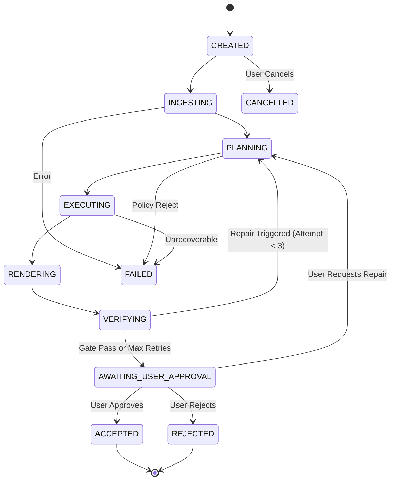

# 📝 Sub Spec: Phase 6 Local Workbench — Upload, Live Progress, Before/After Comparison, Quality Review & Artifact Delivery

> [!ABSTRACT] Tóm tắt cho AI
> **Mục tiêu**: Xây dựng giao diện ứng dụng cục bộ đa nền tảng (Local Cross-Platform Workbench UI & API) cho phép người dùng tải file PPTX, nhập chỉ thị chỉnh sửa ngôn ngữ tự nhiên, theo dõi luồng sự kiện/tiến độ thời gian thực (live event stream), so sánh trực quan slide trước/sau (side-by-side before/after preview), xem chi tiết các cảnh báo chất lượng (structural diff & visual findings), thực hiện phê duyệt/từ chối/yêu cầu sửa tiếp (`Approve` / `Reject` / `Repair`), và tải về artifact kết quả an toàn mà không phụ thuộc CDN bên ngoài.
> **Quyết định then chốt**: Phục vụ UI thuần (zero external CDN dependencies) trực tiếp từ FastAPI backend; tích hợp bộ điều phối `JobOrchestrator` liên kết Ingest $\rightarrow$ Planner $\rightarrow$ Executor $\rightarrow$ Quality Gates; chuẩn hóa REST contract cho quyết định người dùng (`/decision`); đảm bảo an toàn ngoại lệ và hiển thị lỗi thân thiện trên mọi hệ điều hành.
> **Rủi ro**: #risk/LOW | **Trạng thái**: #status/DRAFT

---

## 1. Mục tiêu (Objective)

Cung cấp lát cắt trải nghiệm người dùng & điều phối tổng thể (Phase 6) cho AutoSlide:
1. **Local Web UI & Static Serving**:
   - Giao diện trực quan, hiện đại, responsive, hoàn toàn tự đóng gói (self-contained, không phụ thuộc font/icon/script CDN internet bên ngoài).
   - Tương thích 100% môi trường cục bộ đa nền tảng: Linux, macOS, Windows.
   - Hỗ trợ phím tắt và chuẩn trợ năng cơ bản (WCAG keyboard navigation, ARIA labels, visual contrast).
2. **Job Submission & File Upload**:
   - Drag-and-drop PPTX upload zone kèm validation kích thước file (`max_job_size_bytes`) và định dạng (`.pptx`).
   - Khung nhập chỉ thị ngôn ngữ tự nhiên (Natural-Language Instruction prompt).
   - Tùy chọn lựa chọn Agent Runtime (tự động phát hiện qua `GET /api/v1/runtimes`).
3. **Real-Time Progress & Event Stream**:
   - Hiển thị tiến trình qua pipeline: `INGESTING` $\rightarrow$ `PLANNING` $\rightarrow$ `EXECUTING` $\rightarrow$ `RENDERING` $\rightarrow$ `VERIFYING` $\rightarrow$ `AWAITING_USER_APPROVAL` $\rightarrow$ `ACCEPTED` / `FAILED`.
   - Luồng sự kiện thời gian thực qua Server-Sent Events (SSE) `/api/v1/jobs/{job_id}/events/stream` hoặc REST polling `/api/v1/jobs/{job_id}/events`.
   - Log sự kiện đã được khử thông tin nhạy cảm (redacted) bảo đảm an toàn.
4. **Before/After Previews & Quality Findings**:
   - Trực quan hóa slide gốc và slide đã chỉnh sửa theo dạng so sánh song song (side-by-side) hoặc carousel trượt.
   - Hiển thị danh sách phát hiện chất lượng (`VisualFinding` & `StructuralDiff`):
     - `TEXT_OVERFLOW`, `BOUNDS_CLIPPING`, `COLLATERAL_CHANGE` kèm nhãn mức độ `CRITICAL`, `ERROR`, `WARNING`, `INFO`.
     - Chỉ dẫn khắc phục được đề xuất (`suggested_fix`).
5. **Human Review Decision Flow & Artifact Delivery**:
   - Nút hành động trực quan:
     - **Approve**: Phê duyệt kết quả, chuyển trạng thái sang `ACCEPTED`, kích hoạt tải về file PPTX đã hoàn thiện (`working/presentation.pptx`).
     - **Reject**: Từ chối kết quả, hủy bỏ thay đổi, chuyển sang `REJECTED`.
     - **Request Repair**: Gửi lại phản hồi kèm chỉ thị sửa cho vòng lặp `RepairLoopController`.
   - Tải về các artifact máy đọc (`quality_report.json`, `structural_diff.json`, `task_plan.json`, checkpoint packages).
6. **Runtime Diagnostics & Local Error States**:
   - Bảng điều khiển chẩn đoán runtime hiển thị trạng thái CLI (Codex, Gemini, Claude, Antigravity) và LibreOffice renderer.
   - Xử lý trạng thái lỗi an toàn: thông báo lỗi rõ ràng khi file hỏng, thiếu runtime, timeout, hoặc vượt ngân sách sửa lỗi mà không làm sập ứng dụng.

---

## 2. Giả định & Rủi ro (Assumptions & Risks)

- [x] **Giả định**: Các module Phase 1-5 (`runtime`, `jobs`, `ingest`, `planner`, `executor`, `quality`) đã hoàn thiện và vượt qua 100% test suites.
- [x] **Giả định**: Web UI hoạt động offline trên localhost (`http://127.0.0.1:8000`), không cần kết nối internet hay token API bên thứ ba.
- [ ] **Rủi ro**: Trình duyệt có thể cache ảnh preview cũ khi chuyển đổi các checkpoint sửa đổi $\rightarrow$ *Giải pháp*: Sử dụng query parameter cache-buster (`?v={sha256_or_timestamp}`) trên URL preview.
- [ ] **Rủi ro**: Quá trình render LibreOffice hoặc chạy LLM có thể kéo dài $\rightarrow$ *Giải pháp*: Cung cấp timeout có thể cấu hình, hiển thị spinner/progress bar sinh động, và nút `Cancel Job` tức thời.

---

## 3. Đặc tả Sửa đổi (Surgical Changes)

| File Path | Action | Detail |
| :--- | :--- | :--- |
| `src/autoslide/jobs/models.py` | Modify | Bổ sung các trạng thái `AWAITING_USER_APPROVAL`, `REJECTED` vào `JobState` và khai báo `JobDecisionRequest`, `JobDecisionResponse` |
| `src/autoslide/jobs/registry.py` | Modify | Hỗ trợ chuyển tiếp trạng thái `decision` (approve/reject/repair) trong `JobRegistry` |
| `src/autoslide/orchestrator/__init__.py` | Create | Export interface của pipeline orchestrator |
| `src/autoslide/orchestrator/pipeline.py` | Create | `JobOrchestrator` kết nối toàn bộ luồng Ingest $\rightarrow$ Planner $\rightarrow$ Executor $\rightarrow$ Quality Gates $\rightarrow$ Review |
| `src/autoslide/ui/__init__.py` | Create | Module phục vụ static assets và HTML template |
| `src/autoslide/ui/static/css/workbench.css` | Create | CSS giao diện Workbench hiện đại, dark/light aware, zero-CDN |
| `src/autoslide/ui/static/js/workbench.js` | Create | Logic client: upload, polling/SSE, render preview side-by-side, findings cards, approve/reject handlers |
| `src/autoslide/ui/templates/index.html` | Create | Single-page Workbench HTML template |
| `src/autoslide/api.py` | Modify | Thêm routes: `/`, `/ui`, `/api/v1/jobs/{job_id}/decision`, `/api/v1/jobs/{job_id}/events/stream`, static mount |
| `tests/api/test_workbench_api.py` | Create | Kiểm thử API routes mới: decision endpoint, previews, static asset serving, diagnostics |
| `tests/integration/test_orchestrator_pipeline.py` | Create | Kiểm thử luồng tích hợp hoàn chỉnh Ingest $\rightarrow$ Planner $\rightarrow$ Executor $\rightarrow$ Quality Gates $\rightarrow$ Decision |
| `tests/fixtures/workbench_samples.py` | Create | Fixtures sinh mock job reviews, side-by-side previews và decision payloads |

### 3.1. Thiết kế API & Data Contracts

#### 1. Submit Human Review Decision
- **Endpoint**: `POST /api/v1/jobs/{job_id}/decision`
- **Request Body**:
  ```json
  {
    "decision": "approve", // "approve" | "reject" | "repair"
    "feedback": "Optional user feedback or additional repair instruction"
  }
  ```
- **Response `200 OK`**:
  ```json
  {
    "job_id": "job_123",
    "state": "ACCEPTED", // "ACCEPTED" | "REJECTED" | "PLANNING"
    "message": "Job approved and finalized successfully.",
    "download_url": "/api/v1/jobs/job_123/artifacts/presentation.pptx"
  }
  ```

#### 2. Server-Sent Events (SSE) Stream
- **Endpoint**: `GET /api/v1/jobs/{job_id}/events/stream`
- **Response `text/event-stream`**:
  ```text
  event: state_change
  data: {"job_id": "job_123", "state": "EXECUTING", "timestamp": "2026-09-18T16:35:00Z"}

  event: quality_finding
  data: {"slide_index": 1, "category": "TEXT_OVERFLOW", "severity": "ERROR", "message": "Text overflows bounding box"}
  ```

### 3.2. Sơ đồ Chuyển trạng thái Job State Machine



---

## 4. Tiêu chí Chấp nhận (Acceptance Criteria)

- [x] FastAPI backend phục vụ giao diện Web UI tại route `/` và `/ui` với đầy đủ CSS/JS cục bộ (không gọi bất kỳ domain bên ngoài nào).
- [x] UI cho phép người dùng kéo thả upload file `.pptx`, nhập prompt chỉnh sửa và gửi tạo job thành công.
- [x] Luồng sự kiện hiển thị thời gian thực các bước xử lý và nhật ký hoạt động có khử thông tin nhạy cảm.
- [x] Giao diện so sánh trực quan (Before/After Previews) hiển thị hình ảnh slide trước và sau khi chỉnh sửa cùng danh sách phát hiện chất lượng (`VisualFinding` và `StructuralDiff`).
- [x] Endpoint `POST /api/v1/jobs/{job_id}/decision` xử lý chính xác 3 hành động: `approve` (chuyển `ACCEPTED`), `reject` (chuyển `REJECTED`), và `repair` (kích hoạt vòng lặp sửa).
- [x] Người dùng có thể tải về file `.pptx` đã hoàn thiện và các artifacts máy đọc (`quality_report.json`, `structural_diff.json`, `task_plan.json`).
- [x] Giao diện hiển thị bảng chẩn đoán runtime (`/api/v1/runtimes`) và xử lý an toàn các trạng thái lỗi cục bộ (file lỗi, timeout, render hỏng).
- [x] Toàn bộ test suite (Phase 1-6) đạt 100% passing rate trên pytest, `compileall` sạch và `sanitizer-engine pre-commit` pass.

---

## 5. Kế hoạch Kiểm tra (Verification Plan)

### Automated
```bash
# 1. Chạy các unit test và integration test của Workbench & API
pytest -v tests/api tests/integration

# 2. Chạy toàn bộ regression suite (Foundation + Ingest + Planner + Executor + Quality + Workbench)
pytest -q

# 3. Kiểm tra cú pháp và bytecode compilation
python3 -m compileall src tests

# 4. Kiểm tra bảo mật và rò rỉ secrets
sanitizer-engine pre-commit
```

### Manual QA
1. Khởi động server AutoSlide cục bộ (`python3 -m autoslide.main` hoặc `uvicorn autoslide.api:create_app`).
2. Mở trình duyệt tại `http://127.0.0.1:8000/`.
3. Tải lên một file PPTX mẫu và nhập yêu cầu: `"Thay đổi tiêu đề slide 1 thành Báo cáo Quý 4"`.
4. Quan sát tiến trình live event stream chuyển qua các trạng thái `INGESTING` $\rightarrow$ `PLANNING` $\rightarrow$ `EXECUTING` $\rightarrow$ `AWAITING_USER_APPROVAL`.
5. Kiểm tra preview trước/sau và bảng thông báo chất lượng trên giao diện.
6. Nhấn `Approve` $\rightarrow$ xác nhận tải về file PPTX hoàn thiện và kiểm tra file mở bình thường.

---

## 6. Kết nối Tri thức (Intelligence Context)

- **Impact Analysis**: Bổ sung tầng UI tĩnh (`src/autoslide/ui/`), mở rộng API router (`src/autoslide/api.py`), mở rộng `JobState` và xây dựng `JobOrchestrator` (`src/autoslide/orchestrator/pipeline.py`).
- **Related Sessions**: Phase 1 Foundation (`51a0535` $\rightarrow$ `f127001`), Phase 2 Ingest (`d16c062`), Phase 3 Planner (`9615c2f`), Phase 4 Executor (`e361799`), Phase 5 Quality Gates (`6313649`).
- **Code Graph**: `autoslide.ui` $\rightarrow$ `autoslide.api` $\rightarrow$ `autoslide.orchestrator` $\rightarrow$ (`autoslide.ingest`, `autoslide.planner`, `autoslide.executor`, `autoslide.quality`).

---
*Tài liệu này được tối ưu hóa cho truy vấn AI-Native.*
