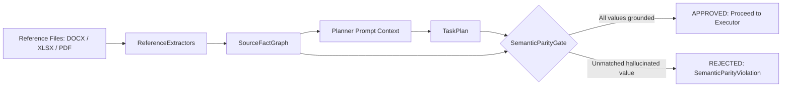

# 📝 Sub Spec: Phase 7 Reference Ingestion — Source Fact Graph, Multi-Format Extractors, Provenance & Semantic Data Parity Gate

> [!ABSTRACT] Tóm tắt cho AI
> **Mục tiêu**: Xây dựng module trích xuất tài liệu tham chiếu (Reference Document Ingestion) hỗ trợ các định dạng DOCX, XLSX, PDF và ảnh; chuẩn hóa các dữ liệu/bảng/biểu đồ thành đồ thị sự kiện nguồn (`SourceFactGraph`) kèm metadata vị trí nguồn (`FactProvenance`) và độ tin cậy (`confidence`); nhúng ngữ cảnh sự kiện an toàn vào Planner prompt payload; thiết lập cổng thẩm định tính nhất quán ngữ nghĩa (`SemanticParityGate`) bảo đảm mọi dữ liệu cập nhật trên slide đều truy vết được nguồn gốc thực tế.
> **Quyết định then chốt**: Mô hình hóa sự kiện có provenance chi tiết (tọa độ cell/paragraph/page/boundingBox); trích xuất cục bộ thuần túy không gửi dữ liệu ra bên ngoài; kiểm soát kích thước file và khử trùng thông tin nhạy cảm (redaction); chặn các thay đổi không có căn cứ (hallucinated data) bằng `SemanticParityGate`.
> **Rủi ro**: #risk/LOW | **Trạng thái**: #status/DRAFT

---

## 1. Mục tiêu (Objective)

Cung cấp lát cắt trích xuất tài liệu tham chiếu & bảo toàn dữ liệu nguồn (Phase 7) cho AutoSlide:
1. **Source Fact Graph & Provenance Schema (`SourceFactGraph`, `SourceFact`, `FactProvenance`)**:
   - Định nghĩa mô hình dữ liệu Pydantic biểu diễn các thực thể sự kiện trích xuất:
     - `fact_id`: Định danh duy nhất theo hash nội dung và vị trí (`fact_{sha256[:12]}`).
     - `category`: `METRIC` (chỉ số tài chính/kỹ thuật), `TABLE_CELL` (ô bảng tính), `PARAGRAPH` (đoạn văn), `KEY_VALUE` (cặp khóa-giá trị), `IMAGE_ENTITY`.
     - `key` / `label`: Tên trường hoặc tiêu đề cột/hàng (ví dụ: `"Q3 Revenue"`, `"Gross Margin"`).
     - `value`: Giá trị chuẩn hóa (chuỗi, số thực, ngày tháng).
     - `provenance`: Nguồn gốc chi tiết:
       - `source_file`: Tên tệp và SHA-256 hash.
       - `location`: Số trang (`page`), tên sheet (`sheet_name`), tọa độ ô (`cell_ref`: `"B14"`), số đoạn (`paragraph_index`), hoặc tọa độ bounding box (`bbox`).
       - `confidence`: Độ tin cậy trích xuất ($0.0 \rightarrow 1.0$).
2. **Local Multi-Format Reference Extractors (`BaseReferenceExtractor`)**:
   - **DOCX Extractor (`DocxReferenceExtractor`)**: Trích xuất tiêu đề, danh sách bullet, bảng biểu (`w:tbl`), và metadata tài liệu Word.
   - **XLSX Extractor (`XlsxReferenceExtractor`)**: Trích xuất các ô số liệu, header bảng, chuỗi thời gian, và phạm vi bảng có nhãn.
   - **PDF Extractor (`PdfReferenceExtractor`)**: Trích xuất các khối văn bản theo trang, bảng cấu trúc và key-value pairs từ file PDF báo cáo.
   - **Image Extractor (`ImageReferenceExtractor`)**: Trích xuất metadata hình ảnh, kích thước, và tạo crop descriptor cho việc thay thế hình ảnh/logo.
3. **Security, Privacy & File Isolation Guardrails**:
   - Hạn chế kích thước tệp: tối đa 50 MB / tệp (`max_reference_size_bytes`).
   - Xử lý lỗi an toàn: từ chối các tệp được mã hóa bảo vệ mật khẩu (`EncryptedFileError`) hoặc tệp hỏng (`MalformedReferenceError`).
   - Tự động lọc/khử nhạy cảm (redaction) đối với các chuỗi nhận diện nhạy cảm (API keys, passwords, credentials).
4. **Prompt Context Mapping for Edit Planner**:
   - Đóng gói `SourceFactGraph` thành bảng compact facts rút gọn để bổ sung vào `PromptPayloadBuilder` của Phase 3.
   - Giúp Agent Planner có căn cứ dữ liệu chính xác khi lập `TaskPlan` cập nhật bảng, biểu đồ và số liệu slide.
5. **Semantic Data Parity Gate (`SemanticParityGate`)**:
   - Đối soát từng thao tác chỉnh sửa giá trị số liệu trong `TaskPlan` so với `SourceFactGraph`.
   - Nếu một thao tác thay đổi số liệu/tiêu đề mà giá trị mới không khớp với bất kỳ `SourceFact` nào hoặc có confidence thấp $\rightarrow$ Báo động `COLLATERAL_CHANGE` hoặc từ chối (`SemanticParityViolationError`).
   - Xuất bằng chứng máy đọc `artifacts/reference_manifest.json` và `artifacts/semantic_parity_report.json`.

---

## 2. Giả định & Rủi ro (Assumptions & Risks)

- [x] **Giả định**: Các file tham chiếu được lưu trong thư mục cách ly `reference/` bên trong `JobWorkspace`.
- [x] **Giả định**: Hệ thống hoạt động hoàn toàn cục bộ (local-first), tận dụng các thư viện chuẩn của Python (`zipfile`, `xml.etree`, `pypdf`/`pdfplumber`, `openpyxl`/`docx`).
- [ ] **Rủi ro**: File PDF scan dạng raster hình ảnh không chứa text layer $\rightarrow$ *Giải pháp*: Trích xuất metadata và hình ảnh trang, cảnh báo `INFO: Scanned PDF without text layer` mà không làm đứt gãy luồng xử lý.
- [ ] **Rủi ro**: Trích xuất bảng tính Excel với các ô công thức chưa được tính toán (`FormulaCells`) $\rightarrow$ *Giải pháp*: Đọc cached calculated values hoặc cảnh báo công thức chưa tính.

---

## 3. Đặc tả Sửa đổi (Surgical Changes)

| File Path | Action | Detail |
| :--- | :--- | :--- |
| `src/autoslide/reference/__init__.py` | Create | Export các interface chính của module reference ingestion |
| `src/autoslide/reference/models.py` | Create | Pydantic models: `FactProvenance`, `SourceFact`, `SourceFactGraph`, `ReferenceManifest`, `SemanticParityReport` |
| `src/autoslide/reference/errors.py` | Create | Exceptions: `ReferenceIngestError`, `UnsupportedFormatError`, `EncryptedFileError`, `MalformedReferenceError`, `SemanticParityViolationError` |
| `src/autoslide/reference/extractors/base.py` | Create | Abstract class `BaseReferenceExtractor` định nghĩa hàm `extract(path: Path) -> list[SourceFact]` |
| `src/autoslide/reference/extractors/docx.py` | Create | `DocxReferenceExtractor` trích xuất văn bản, bảng và bullet points từ `.docx` |
| `src/autoslide/reference/extractors/xlsx.py` | Create | `XlsxReferenceExtractor` trích xuất bảng tính, sheet names, cells và named ranges từ `.xlsx` |
| `src/autoslide/reference/extractors/pdf.py` | Create | `PdfReferenceExtractor` trích xuất văn bản có cấu trúc và bảng từ `.pdf` |
| `src/autoslide/reference/extractors/image.py` | Create | `ImageReferenceExtractor` trích xuất metadata hình ảnh từ `.png`, `.jpg`, `.jpeg` |
| `src/autoslide/reference/ingestor.py` | Create | `ReferenceIngestor` điều phối trích xuất đa tệp, tổng hợp `SourceFactGraph` và lưu artifacts |
| `src/autoslide/reference/parity.py` | Create | `SemanticParityGate` đối soát thay đổi số liệu trong `TaskPlan` với `SourceFactGraph` |
| `tests/reference/__init__.py` | Create | Package init cho reference tests |
| `tests/reference/test_extractors.py` | Create | Kiểm thử trích xuất chi tiết trên các tệp mẫu DOCX, XLSX, PDF, Image |
| `tests/reference/test_fact_graph.py` | Create | Kiểm thử cấu trúc `SourceFactGraph`, provenance metadata và serialization |
| `tests/reference/test_semantic_parity.py` | Create | Kiểm thử `SemanticParityGate` chấp thuận giá trị có căn cứ và từ chối hallucinated updates |
| `tests/fixtures/reference_samples.py` | Create | Fixtures sinh mock DOCX, XLSX, PDF và image files cùng fact graphs |

### 3.1. Thiết kế Schema & Contracts

```python
class FactProvenance(BaseModel):
    source_filename: str
    source_sha256: str
    format: str  # "docx", "xlsx", "pdf", "image"
    sheet_name: str | None = None
    page_number: int | None = None
    cell_ref: str | None = None
    paragraph_index: int | None = None
    bounding_box: tuple[int, int, int, int] | None = None
    confidence: float = 1.0


class SourceFact(BaseModel):
    fact_id: str
    category: str  # "METRIC", "TABLE_CELL", "PARAGRAPH", "KEY_VALUE"
    label: str
    value: str
    numeric_value: float | None = None
    unit: str | None = None
    provenance: FactProvenance


class SourceFactGraph(BaseModel):
    graph_id: str
    source_files: list[str]
    facts: list[SourceFact]
    created_at: str
```

### 3.2. Quy trình Hoạt động của Semantic Data Parity Gate



---

## 4. Tiêu chí Chấp nhận (Acceptance Criteria)

- [ ] `ReferenceIngestor` trích xuất thành công dữ liệu từ 4 định dạng tệp chuẩn: DOCX, XLSX, PDF và ảnh raster (PNG/JPEG).
- [ ] Mỗi `SourceFact` sinh ra mang đầy đủ metadata nguồn gốc `FactProvenance` (tên tệp, SHA-256, sheet/page/cell, confidence).
- [ ] Trích xuất bảng tính XLSX giữ đúng quan hệ tiêu đề cột và hàng, chuẩn hóa giá trị số (`numeric_value`).
- [ ] Trích xuất DOCX phân loại đúng đoạn văn bản (`PARAGRAPH`) và cấu trúc bảng (`TABLE_CELL`).
- [ ] Tệp được bảo vệ bằng mật khẩu hoặc tệp bị hỏng được xử lý an toàn bằng việc ném ngoại lệ rõ ràng (`EncryptedFileError`, `MalformedReferenceError`) mà không làm sập ứng dụng.
- [ ] `SemanticParityGate` xác nhận 100% các giá trị cập nhật trong `TaskPlan` có nguồn gốc tương ứng từ `SourceFactGraph` và từ chối các giá trị không có căn cứ.
- [ ] Sinh đầy đủ các bằng chứng máy đọc `artifacts/reference_manifest.json` và `artifacts/semantic_parity_report.json` trong job workspace.
- [ ] Toàn bộ test suite (Phase 1-7) đạt 100% passing rate trên pytest, `compileall` sạch và `sanitizer-engine pre-commit` pass.

---

## 5. Kế hoạch Kiểm tra (Verification Plan)

### Automated
```bash
# 1. Chạy các unit test của module reference ingestion
pytest -v tests/reference

# 2. Chạy toàn bộ regression suite (Foundation + Ingest + Planner + Executor + Quality + Workbench + Reference)
pytest -q

# 3. Kiểm tra cú pháp và bytecode compilation
python3 -m compileall src tests

# 4. Kiểm tra bảo mật và rò rỉ secrets
sanitizer-engine pre-commit
```

### Manual QA
1. Khởi tạo một job chứa tệp Excel `Q3_Financials.xlsx` (có ô `"Revenue" = "$14.2M"`) và tài liệu Word `Summary.docx`.
2. Chạy `ReferenceIngestor.ingest(...)` $\rightarrow$ kiểm tra `SourceFactGraph` chứa fact `"Revenue"` với `cell_ref="B4"`.
3. Lập `TaskPlan` cập nhật tiêu đề slide thành `"Q3 Revenue reached $14.2M"`.
4. Chạy `SemanticParityGate.evaluate(plan, fact_graph)` $\rightarrow$ xác nhận verdict `APPROVED`.
5. Lập `TaskPlan` cố ý đưa vào số liệu giả `"Q3 Revenue reached $99.9M"` $\rightarrow$ xác nhận `SemanticParityGate` từ chối và cảnh báo không có căn cứ nguồn.

---

## 6. Kết nối Tri thức (Intelligence Context)

- **Impact Analysis**: Module mới độc lập dưới `src/autoslide/reference/`, cung cấp context cho `src/autoslide/planner/` và xác thực cho `src/autoslide/orchestrator/`.
- **Related Sessions**: Phase 1 Foundation (`51a0535`), Phase 2 PPTX Ingest (`d16c062`), Phase 3 Planner (`9615c2f`), Phase 4 Executor (`e361799`), Phase 5 Quality Gates (`6313649`), Phase 6 Workbench (`3686ef3`).
- **Code Graph**: `autoslide.reference` $\rightarrow$ `autoslide.planner` $\rightarrow$ `autoslide.orchestrator` $\rightarrow$ `autoslide.quality`.

---
*Tài liệu này được tối ưu hóa cho truy vấn AI-Native.*
