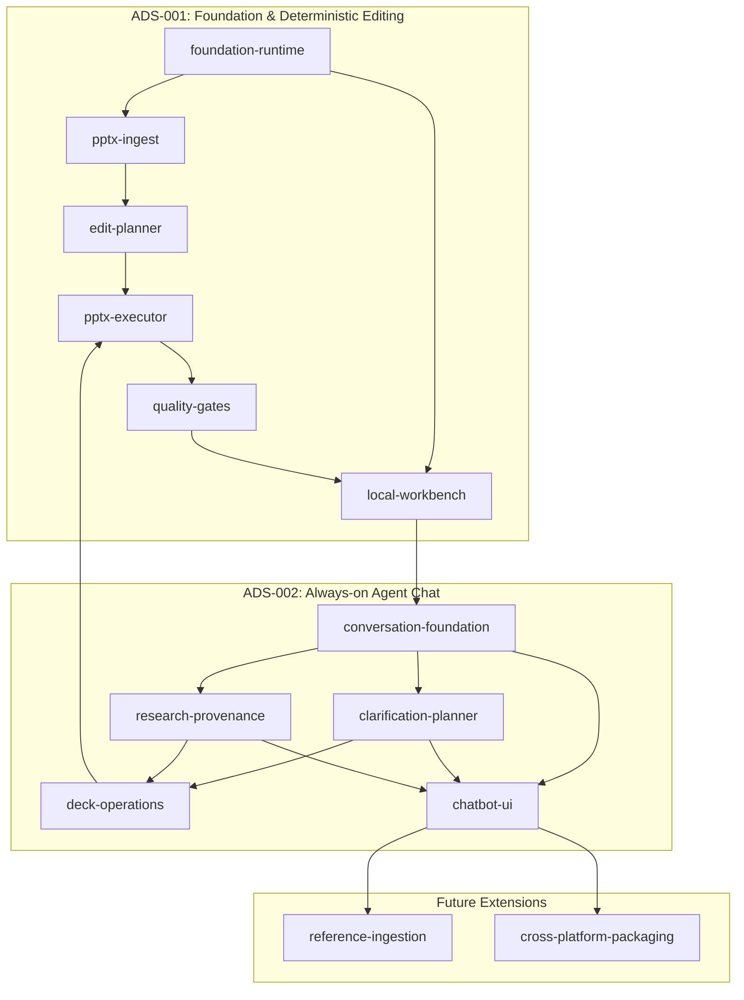

# AutoSlide Capability Map

## Product scope

AutoSlide is a local-first application that accepts a PowerPoint template and natural-language instructions, edits the existing presentation while preserving its visual and structural intent, verifies the result through structural and visual quality gates, and returns a completed editable `.pptx`.

With **ADS-002**, AutoSlide adds an always-on conversational chatbot rail supporting multi-turn dialogue, clarification questions, plan and web source approvals, safe deck operations, provenance tracking, and follow-up turns against current checkpoints.

## Capability boundaries

| Module ID | Responsibility | Depends on | Delivery status |
|---|---|---|---|
| `foundation-runtime` | Local app bootstrap, job workspace, configuration, runtime detection and CLI adapters | — | ✅ Delivered (ADS-001) |
| `pptx-ingest` | PPTX package inspection, object inventory, thumbnails and stable target references | `foundation-runtime` | ✅ Delivered (ADS-001) |
| `edit-planner` | Natural-language instruction parsing and typed, scope-constrained edit plan | `pptx-ingest`, `foundation-runtime` | ✅ Delivered (ADS-001) |
| `pptx-executor` | Deterministic text/style/layout edits with preservation rules | `edit-planner`, `pptx-ingest` | ✅ Delivered (ADS-001) |
| `quality-gates` | Structural diff, render, visual QA, repair and approval evidence | `pptx-executor` | ✅ Delivered (ADS-001) |
| `local-workbench` | Browser UI, job progress, previews, review and download | `foundation-runtime`, `quality-gates` | ✅ Delivered (ADS-001) |
| `conversation-foundation` | Stateful chat session, turn history, checkpoint store and event log | `foundation-runtime`, `local-workbench` | ✅ Delivered (ADS-002) |
| `clarification-planner` | Targeted clarification questions, missing-field brief analysis, plan cards | `conversation-foundation`, `edit-planner` | ✅ Delivered (ADS-002) |
| `research-provenance` | Runtime-mediated web search, AI generation, source approval, attribution | `conversation-foundation`, `foundation-runtime` | ✅ Delivered (ADS-002) |
| `deck-operations` | Allowlisted add/delete/duplicate/reorder slides & arbitrary content ops | `edit-planner`, `pptx-executor` | ✅ Delivered (ADS-002) |
| `chatbot-ui` | Always-on chat rail, interactive cards, selection context binding | `conversation-foundation`, `local-workbench` | ✅ Delivered (ADS-002) |
| `reference-ingestion` | Reference DOCX/XLSX/PDF file parsing, provenance graph and data updates | `quality-gates`, `chatbot-ui` | ⏳ Planned (ADS-003) |
| `cross-platform-packaging` | Linux/macOS/Windows installers, dependency checks and upgrade flow | `foundation-runtime`, `chatbot-ui` | ⏳ Planned (ADS-004) |

## Dependency direction

## Build order

1. **ADS-001 Foundation**: `foundation-runtime → pptx-ingest → edit-planner → pptx-executor → quality-gates → local-workbench` (Completed).
2. **ADS-002 Conversational Layer**: `conversation-foundation → clarification-planner → session-api → research-provenance → deck-operations → chatbot-ui` (Completed).
3. **Future**: `reference-ingestion → cross-platform-packaging`.
