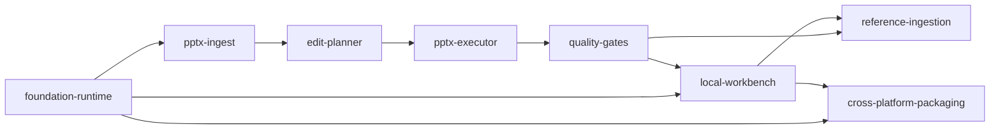

# AutoSlide Capability Map

## Product scope

AutoSlide is a local-first application that accepts a PowerPoint template and a natural-language update request, edits the existing presentation while preserving its visual and structural intent, verifies the result, and returns a completed editable `.pptx`.

The MVP intentionally does not load DOCX, XLSX, PDF or external reference documents. Those inputs are deferred until the template-preserving PPTX editing path is reliable.

## Capability boundaries

| Module ID | Responsibility | Depends on | Delivery phase |
|---|---|---|---|
| `foundation-runtime` | Local app bootstrap, job workspace, configuration, runtime detection and CLI adapters | — | 1 |
| `pptx-ingest` | PPTX package inspection, object inventory, thumbnails and stable target references | `foundation-runtime` | 2 |
| `edit-planner` | Natural-language instruction parsing and typed, scope-constrained edit plan | `pptx-ingest`, `foundation-runtime` | 3 |
| `pptx-executor` | Deterministic text/style/layout edits with preservation rules | `edit-planner`, `pptx-ingest` | 4 |
| `quality-gates` | Structural diff, render, visual QA, repair and approval evidence | `pptx-executor` | 5 |
| `local-workbench` | Browser UI, job progress, previews, review and download | `foundation-runtime`, `quality-gates` | 6 |
| `reference-ingestion` | DOCX/XLSX/PDF/image sources, provenance graph and data-grounded updates | `quality-gates`, `local-workbench` | 7 |
| `cross-platform-packaging` | Linux/macOS/Windows installers, dependency checks and upgrade flow | `foundation-runtime`, `local-workbench` | 8 |

## Dependency direction

## Build order

`foundation-runtime → pptx-ingest → edit-planner → pptx-executor → quality-gates → local-workbench → reference-ingestion → cross-platform-packaging`

The first releasable vertical slice is: `foundation-runtime + pptx-ingest + edit-planner + pptx-executor + quality-gates`. The UI may be a minimal local job endpoint during early development and becomes a complete workbench in phase 6.
